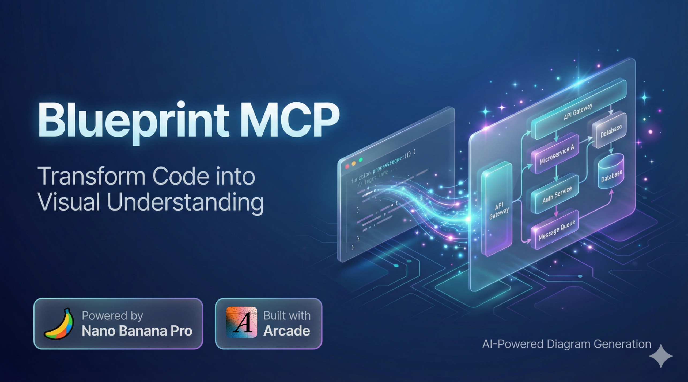
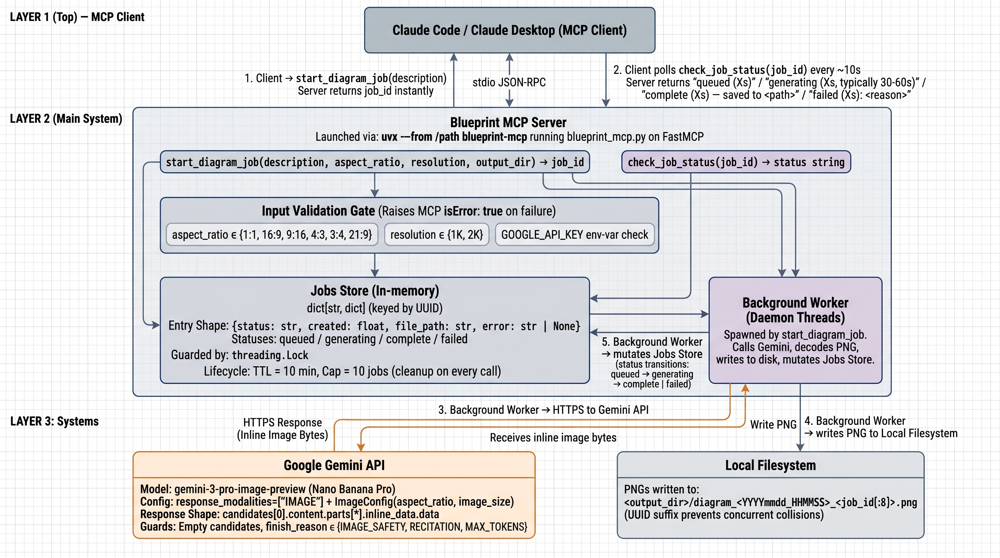
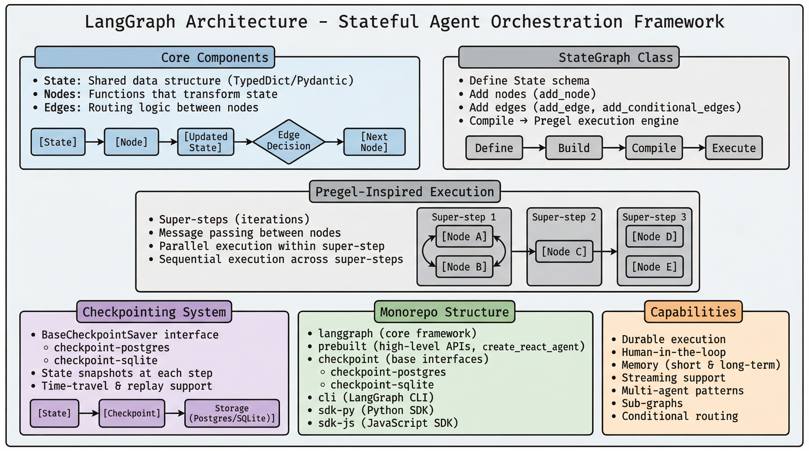

# etch



Etch your codebase into a printable diagram. An MCP server that turns code and architecture descriptions into PNGs using Google's Nano Banana Pro (Gemini 3 Pro Image).

## Setup

Install [uv](https://docs.astral.sh/uv/) (`uv` ships `uvx`). Get a Google AI Studio API key at https://aistudio.google.com/. Then add etch to your MCP client config — for example Claude Desktop's `claude_desktop_config.json`:

```json
{
  "mcpServers": {
    "etch": {
      "command": "uvx",
      "args": ["--from", "/path/to/etch", "etch"],
      "env": { "GOOGLE_API_KEY": "your_api_key_here" }
    }
  }
}
```

`uvx` builds an isolated env on first launch and caches it; no manual install step. Swap `--from /path/to/etch` for `--from git+https://github.com/<owner>/etch` to install from git instead.

## Tools

Generation is async to stay within MCP client tool-call timeouts:

- `start_diagram_job(description, aspect_ratio="16:9", resolution="2K", output_dir=None, audience=None)` — kicks off generation, returns a `job_id` immediately. When `audience` is provided (free-form string up to 4000 chars), the description is wrapped with a frame instructing the model to tailor abstraction, vocabulary, emphasis, and visual register to that audience. When `audience` is `None` or empty, the prompt is byte-identical to the no-audience case.
- `check_job_status(job_id)` — poll every ~10s. Returns `queued (Xs)`, `generating (Xs)`, `complete (Xs) — saved to <path>`, or `failed (Xs): <reason>`.

`aspect_ratio` ∈ `{1:1, 16:9, 9:16, 4:3, 3:4, 21:9}`. `resolution` ∈ `{1K, 2K}`. Generation typically takes 30–60s. The PNG is written to `output_dir` (default cwd); the server and client must share a filesystem.

## Skill

For audience-aware generation from inside Claude Code, this repo also ships an `etch` skill at `skills/etch/SKILL.md`. The skill activates when the user asks for a technical or architecture diagram aimed at a specific audience (architect, developer, PM, end user, executive, ops/SRE, or anything else describable), infers the audience and canvas shape from context, runs a single multi-choice interview only when context is too thin, and calls the MCP with a rich `audience` prose block. The MCP itself is audience-agnostic — the skill carries the per-audience guidance, which means future skills (or different clients) can call the MCP without buying into this audience model.

## Architecture



## Example



Generated from a prompt asking for a printable LangGraph architecture learning card with sections for core components, the StateGraph workflow, Pregel-inspired execution, checkpointing, monorepo layout, and capabilities.
