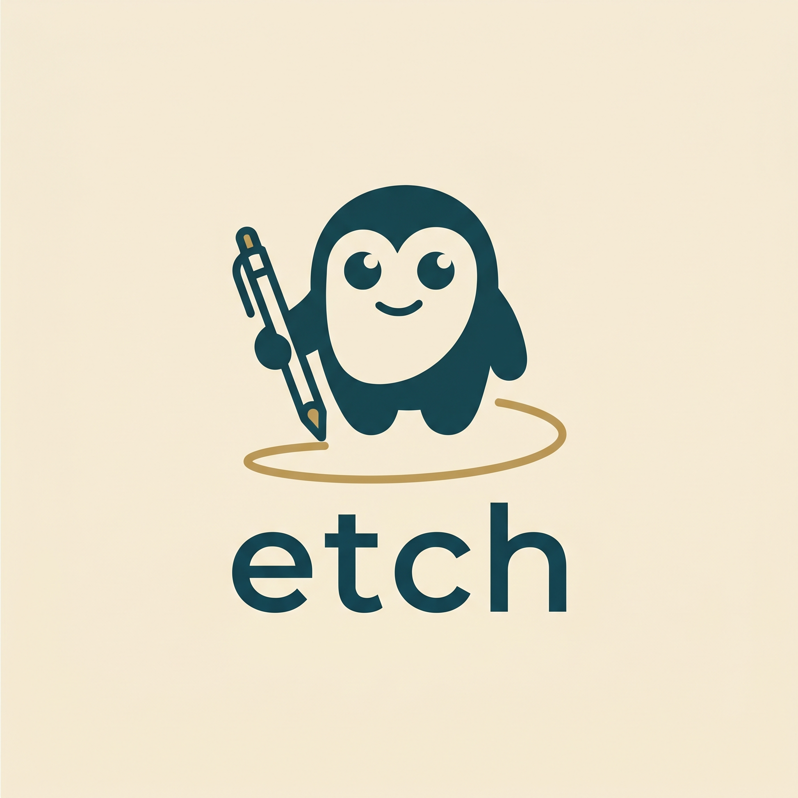
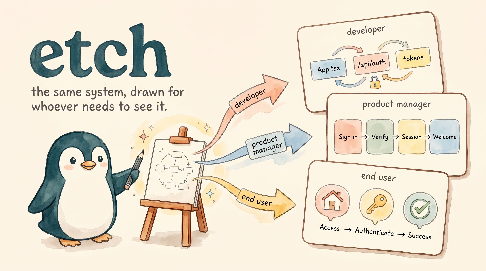
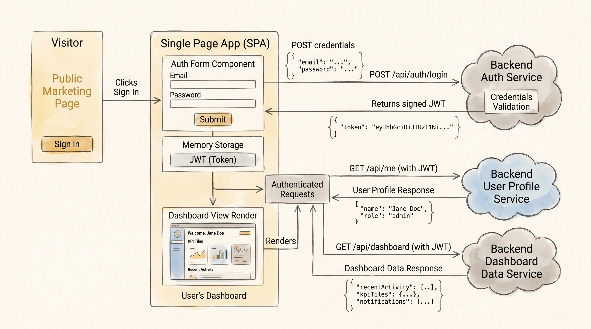
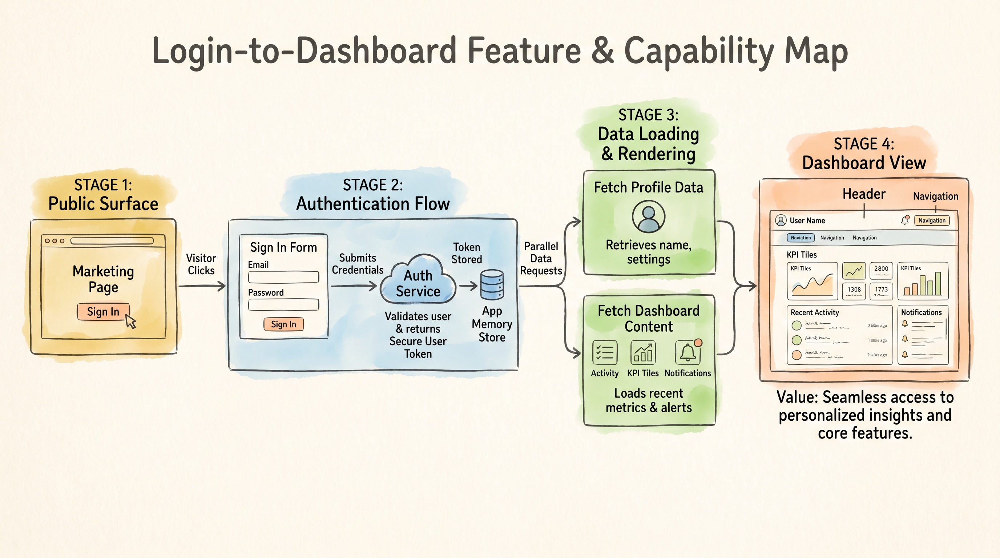
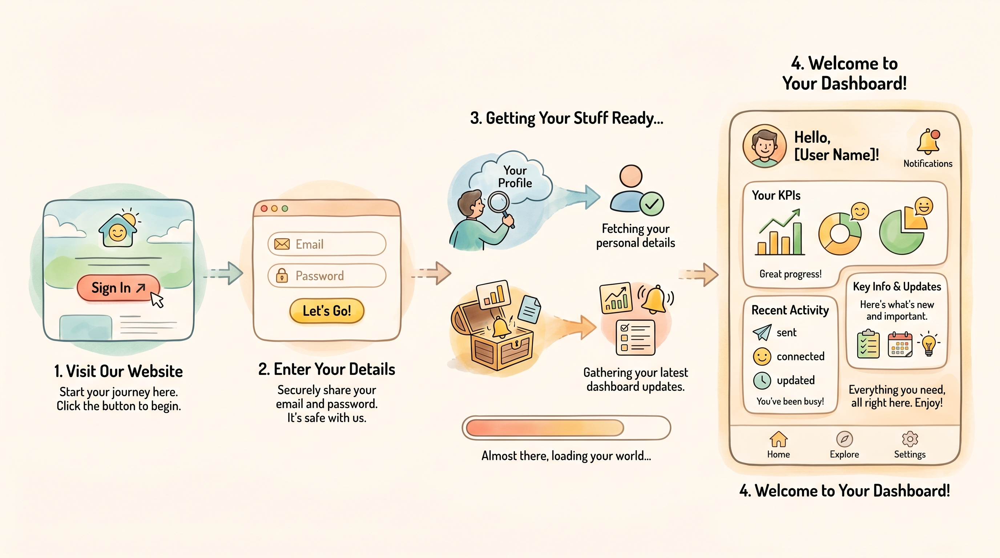
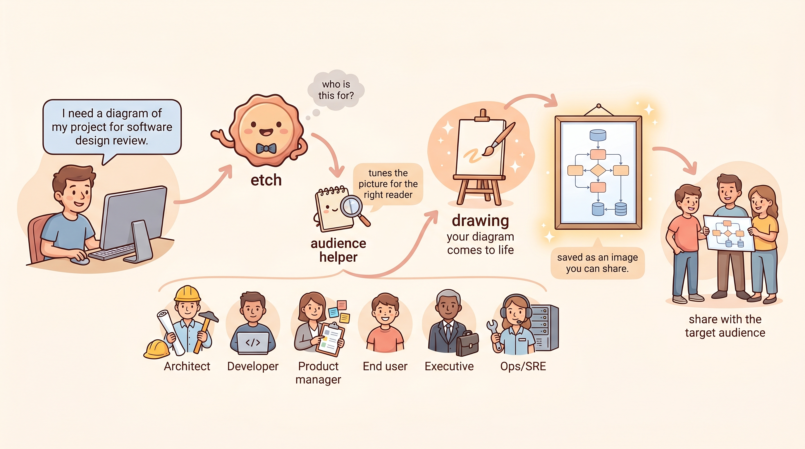

<p align="center">
  
</p>

# etch

Etch your codebase into a printable diagram, tailored to whoever needs to see it.



The same description of a single-page app's login-to-dashboard journey, etched for three audiences:

**Developer** — onboarding to this codebase



**Product manager** — presenting in a product review



**End user** — opening the app for the first time



Same description in. Whichever diagram each audience needs out.

## Why etch

Diagrams are scarce in your docs because drawing them is slow. Worse, the same system needs to look one way in a runbook, another in an exec deck, and a third in onboarding — so the cost compounds. etch generates whichever version you need, from one description, in 30–60 seconds.

It runs as an MCP server, so it plugs into any MCP-aware agent. Generation runs through a pluggable image provider — Google's Nano Banana Pro (Gemini 3 Pro Image) by default, its fast sibling Nano Banana 2, or Microsoft's MAI-Image-2.5 if you prefer.

## Who it is for

- People who want a diagram and don't want to draw it.
- People who want the same system shown several different ways for several different rooms.
- Anyone whose READMEs, runbooks, slide decks, and onboarding docs feel undersupplied with diagrams.

## Quick start

Add etch to your MCP client config (Claude Desktop's `claude_desktop_config.json`, or equivalent):

```json
{
  "mcpServers": {
    "etch": {
      "command": "uvx",
      "args": ["--from", "/path/to/etch", "etch"],
      "env": { "GOOGLE_API_KEY": "your_api_key_here" }
    }
  }
}
```

Restart your agent, then try: *"etch a diagram of three boxes connected by arrows."* You'll get back a `job_id`, then ~30–60s later a saved PNG.

For the long version (uv install, alternative install paths, troubleshooting), see [`install.md`](install.md).

## Tools

Generation is async to stay within MCP client tool-call timeouts:

- `start_diagram_job(description, aspect_ratio="16:9", resolution="2K", output_dir=None, audience=None, model="gemini-3-pro-image-preview", reference_images=None)` — kicks off generation, returns a `job_id` immediately. When `audience` is provided (free-form string up to 4000 chars), etch wraps your description with instructions to tailor abstraction, vocabulary, emphasis, and visual register to that audience. When `audience` is `None` or empty, the prompt is byte-identical to the no-audience case. The `model` param picks the image provider (defaults to Gemini); see [Models](#models). `reference_images` takes a list of image file paths (typically a prior job's output PNG) to condition the new render on; see [Draft to final](#draft-to-final-refining-with-reference-images).
- `start_variant_job(descriptions, aspect_ratio="16:9", resolution="512px", output_dir=None, audience=None, model="gemini-3.1-flash-image")` — takes 1–5 descriptions, each a distinct composition of the same diagram, and generates one image per description, concurrently, under a single `job_id`. Defaults to Nano Banana 2 at 512px so a whole set of candidates stays cheap; see [Variants: pick one, refine it](#variants-pick-one-refine-it). The `audience` wrap applies to each description.
- `check_job_status(job_id)` — poll every ~10s. Single-image jobs return `queued (Xs)`, `generating (Xs)`, `complete (Xs) — saved to <path>`, or `failed (Xs): <reason>`. Variant jobs return `generating (Xs elapsed, k/n complete)` while running, then `complete (Xs) — k/n variants saved` followed by one `variant <i>: <path>` line per saved image, in input order. If some variants fail, the job still completes with the ones that saved; only zero successes marks it `failed`.

`aspect_ratio` ∈ `{1:1, 16:9, 9:16, 4:3, 3:4, 21:9}`. `resolution` ∈ `{1K, 2K}`, plus `512px` on `gemini-3.1-flash-image`. The PNGs are written to `output_dir` (default cwd); the server and client must share a filesystem. (`mai-image-2.5` is ~1 MP — 1K only, no 21:9; an unsupported combo is rejected up front, not silently downscaled.)

## Models

etch generates through a pluggable provider seam. Gemini is the default; MAI-Image-2.5 is an optional alternative.

| model id | provider | capabilities | ≈ price per image | env |
|-|-|-|-|-|
| `gemini-3-pro-image-preview` (default) | Google Gemini 3 Pro Image (Nano Banana Pro) | all ratios incl. 21:9; 1K & 2K; up to 14 reference images | $0.134 at 1K | `GOOGLE_API_KEY` |
| `gemini-3.1-flash-image` | Google Gemini 3.1 Flash Image (Nano Banana 2) | all ratios incl. 21:9; 512px, 1K & 2K; up to 14 reference images | $0.02–0.03 at 512px; ~$0.067 at 1K/2K | `GOOGLE_API_KEY` |
| `mai-image-2.5` | Microsoft MAI-Image-2.5 (Azure Foundry **or** OpenRouter) | all ratios except 21:9 (1:1, 16:9, 9:16, 4:3, 3:4); 1K only; no reference images | — | `MAI_API_KEY`+`MAI_ENDPOINT`, or `OPENROUTER_API_KEY` |

Nano Banana 2 is Pro's fast sibling: roughly 95% of Pro's quality at about half the price, and the only model with the cheap 512px tier — which is what makes generating several candidate compositions and picking one affordable (see [Variants: pick one, refine it](#variants-pick-one-refine-it)).

MAI setup (endpoint, deployment, the OpenRouter alternative) is covered in [`install.md`](install.md).

## Draft to final: refining with reference images

Gemini's image model has no reproducibility seed — it's autoregressive, so the same prompt and settings produce a different image every time you call it. There's no way to resubmit a prompt and get the same picture back.

To carry an approved draft's composition and style forward into a higher-resolution or refined render, pass the draft's PNG back in as a reference image instead of re-describing it:

```
start_diagram_job(description, reference_images=["path/to/approved_draft.png"], resolution="2K")
```

Gemini accepts up to 14 reference images this way — hand it one prior output, or several, and it conditions the new render on them. `mai-image-2.5` is text-to-image only: it accepts no reference images and rejects the call up front (before a job is queued) if you pass any.

This is the workflow for "sketch a rough draft, approve it, then refine or up-res it" — regenerating from the prompt alone gives you a different composition, not a sharper version of the one you approved.

## Variants: pick one, refine it

Since every run is a fresh roll, you can't shop for a good composition by re-running one prompt. The cheap way to land one is to generate several deliberate candidates at low resolution, pick the best, and refine the pick:

1. **Author variants.** Your agent writes up to 5 distinct compositions of the same diagram — same content, different layout, grouping, or emphasis.
2. **Generate them cheaply.** `start_variant_job(descriptions=[...])` renders one 512px image per composition on Nano Banana 2, concurrently, under one `job_id`. Results come back in input order, so each path maps to the composition that produced it.
3. **Pick.** The agent presents the images and recommends one; you choose.
4. **Refine the winner.** `start_diagram_job(description, model="gemini-3.1-flash-image", resolution="2K", reference_images=["path/to/the_pick.png"])` re-renders the chosen composition at full resolution.

Variants and the final render must use the **same model**. The refine step carries the composition forward through the picked image, and that image feedback only transfers within one model — these models are seedless, so a prompt alone can't reproduce a composition. Switching models between the variants and the final means starting over.

## Audience-aware mode (Claude Code)

If you use Claude Code, the bundled skill at `skills/etch/SKILL.md` picks the audience from context — when you ask for a "diagram of the auth service for the runbook" or "an exec slide of the system", it infers the audience and shapes the prompt for you. Without the skill, pass `audience` to `start_diagram_job` directly.

The MCP itself is audience-agnostic; the skill carries the per-audience guidance, so different clients (or future skills) can call the MCP without buying into this audience model.

## How it works



The short version is in [`how-it-works.md`](how-it-works.md): how the MCP server, the audience-aware skill, and the image provider (Gemini 3 Pro Image, Nano Banana 2, or MAI-Image-2.5) fit together.
