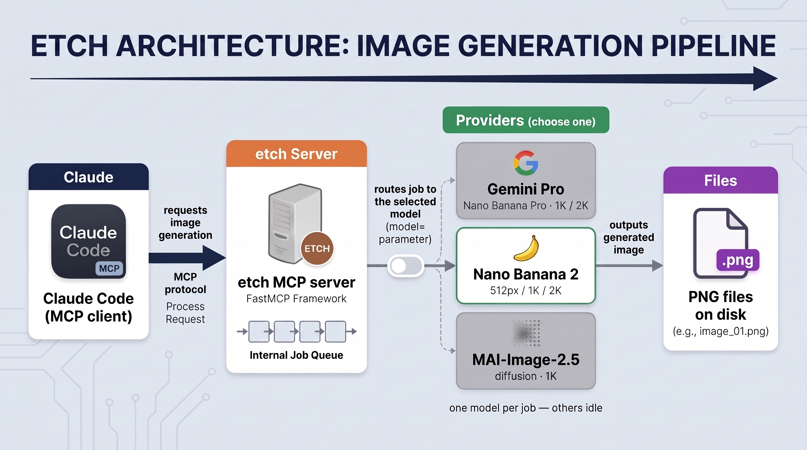

# How etch works

Under the hood, etch is a thin MCP server wrapping a small provider abstraction over image backends — Google's Gemini 3 Pro Image (Nano Banana Pro) by default, its fast sibling Nano Banana 2 (`gemini-3.1-flash-image`), plus Microsoft's MAI-Image-2.5 — selected per call via the `model` parameter. When your agent calls `start_diagram_job`, the server kicks off generation on a background thread, returns a `job_id` immediately, and lets the agent poll `check_job_status` until the PNG lands on disk. The async split exists so MCP tool-call timeouts don't bite — generation typically runs 30–60 seconds.

The seam is an `ImageProvider` protocol with one adapter per backend, wired through a registry keyed by model id. Each provider declares its own capabilities, so etch rejects an unsupported `(model, aspect_ratio, resolution)` combo up front (MAI can't do 2K or 21:9, for instance) rather than silently downscaling, and a missing provider key fails fast before the job queues. Provider errors are sanitized through a `GenerationError` type so endpoints and keys never leak into agent-facing messages.

The same provider capabilities cover reference-image conditioning: both Gemini models take up to 14 reference images (e.g. a prior job's PNG) and fold them into the render; MAI takes none and rejects the call before the job queues. This is how a draft gets carried into a refined or higher-resolution final render — Gemini's image models have no reproducibility seed, so resubmitting the same prompt alone produces a different image each time.

Variant jobs ride the same machinery. `start_variant_job` takes up to five agent-authored compositions of the same diagram and fans them out concurrently — one generation per description, one `job_id` for the set, with `check_job_status` reporting k/n progress and, on completion, the saved paths in input order. It defaults to Nano Banana 2 at 512px, which makes the set cheap enough to treat as first choices: the caller picks one, then refines the pick into the final render with `start_diagram_job` on the same model, passing the picked PNG as a reference image. Both stages stay on one model deliberately — the reference image is what carries the chosen composition forward, and that feedback doesn't transfer across models.

The audience-aware part lives in the skill at `skills/etch/SKILL.md`, not in the server. The skill reads the conversation, picks an audience (architect, developer, product manager, end user, executive, ops/SRE — or anything else describable), picks the canvas shape, and expands the choice into a curated prose block. That prose flows into the MCP via the `audience` parameter, which the server wraps with a small frame and forwards to the model verbatim. The server itself has no per-audience opinions; the skill carries them all, and the skill stays provider-agnostic — it shapes prose, not backends, so the same audience choices ride any model. Different clients (or future skills with a different audience model) can call the same server without buying into this one.
